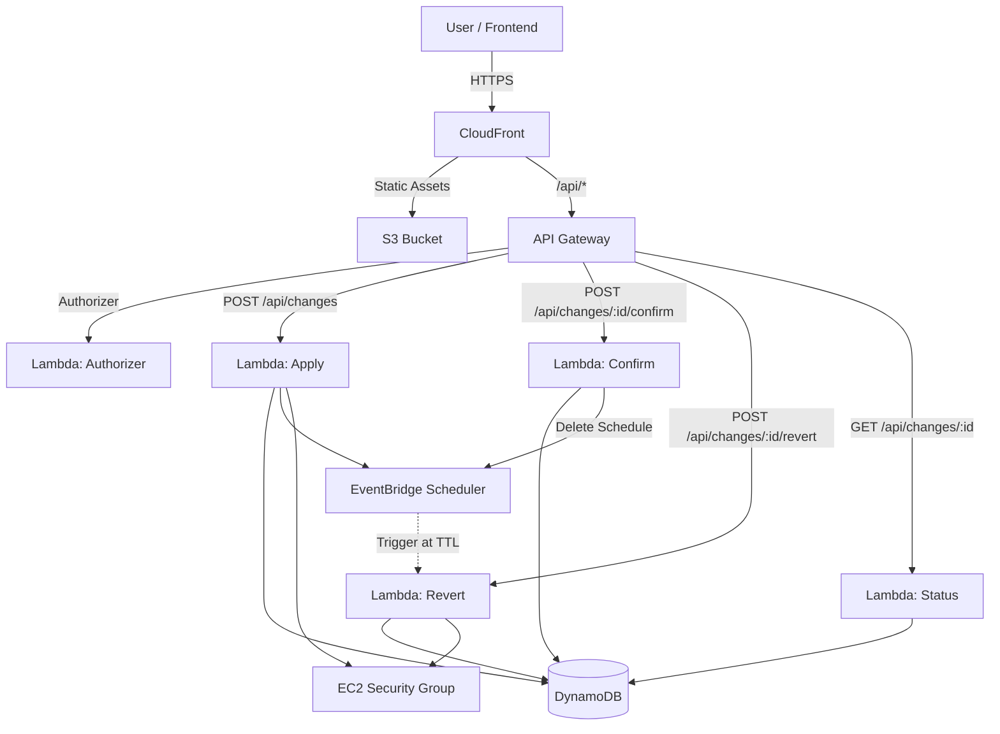

# Deadman Architecture

```mermaid
graph TD
    Client[User / Frontend] -->|HTTPS| CF[CloudFront]
    CF -->|Static Assets| S3[S3 Bucket]
    CF -->|/api/*| API[API Gateway]
    
    API -->|Authorizer| Auth[Lambda: Authorizer]
    API -->|POST /api/changes| Apply[Lambda: Apply]
    API -->|POST /api/changes/:id/confirm| Confirm[Lambda: Confirm]
    API -->|POST /api/changes/:id/revert| Revert[Lambda: Revert]
    API -->|GET /api/changes/:id| Status[Lambda: Status]
    
    Apply --> DDB[(DynamoDB)]
    Confirm --> DDB
    Revert --> DDB
    Status --> DDB
    
    Apply --> Sched[EventBridge Scheduler]
    Sched -.->|Trigger at TTL| Revert
    Confirm -->|Delete Schedule| Sched
    
    Apply --> EC2[EC2 Security Group]
    Revert --> EC2
```
