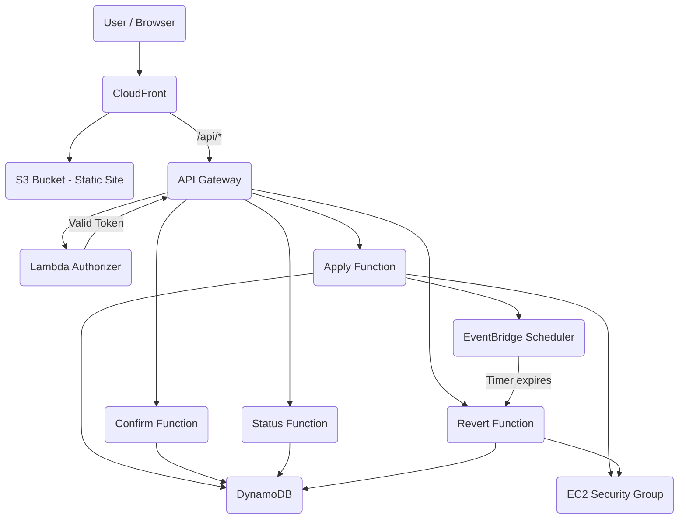

# Architecture

| Component | Description |
|-----------|-------------|
| **S3 + CloudFront** | Hosts the static React frontend and routes `/api/*` traffic to the backend API Gateway. |
| **API Gateway + Lambda Authorizer** | Exposes the HTTP API and performs Bearer token validation on every request. |
| **AWS Lambda** | 4 serverless functions (`apply`, `confirm`, `revert`, `status`) containing the core logic. |
| **DynamoDB** | Stores change plans, execution snapshots, current status, and security group locks. |
| **EventBridge Scheduler** | Creates a precise, one-time timer schedule for each change to automatically trigger the revert function. |
| **EC2 + Security Group** | The demonstration target where ingress rules are modified. |

**Region:** `ap-southeast-2` (Project Sandbox restriction)
